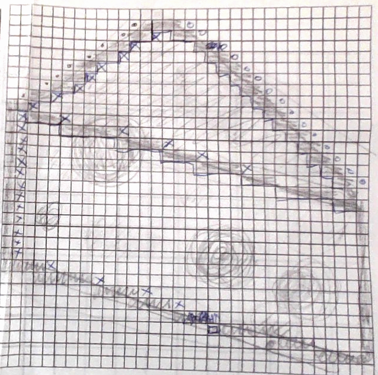
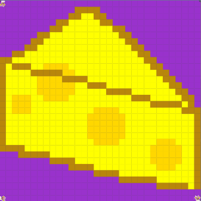

# Unit 1 - Asphalt Art

## Introduction

Cities use asphalt art to improve public safety, inspire their residents and visitors, and brighten communities. Your goal is to create asphalt art to revitalize The Neighborhood and bring the community together with the help of the Painter.

## Requirements

Use your knowledge of object-oriented programming, algorithms, the problem solving process, and decomposition strategies to create asphalt art:
- **Create a new subclass** – Create at least one new subclass of the PainterPlus class that is used for a component of the asphalt art design.
- **Plan an algorithm** – Use the problem solving process and decomposition strategies to plan an algorithm that incorporates a combination of sequencing, selection, and/or iteration.
- **Write a method** – Write at least one method in a PainterPlus subclass that contributes to a component of the asphalt art design.
- **Document your code** – Use comments to explain the purpose of the methods and code segments.

## Notes: Neighborhood & Painter Class

This project was created on Code.org's JavaLab platform using the built in Neightborhood GUI output. To test and edit this project you must build in Code.org's JavaLab with the Neighborhood GUI enabled. For reference to the Painter class documentation, [you can read more here.](https://studio.code.org/docs/ide/javalab/classes/Painter)

## Output:
Draft:

Final Painting:

## Reflection

1. Describe your project.

   - For my Unit 1 Asphalt project, I used java to paint a block of cheese. Consisting of multiple subclasses, my code efficiently paints the block of cheese section by section, using methods and for-loops to help simplify the painting process. I painted cheese because it is one of me and my little sister's favorite foods. We like eating cheese pizza, cheese fries, cheeseburgers, and so on. 

2. What are two things about your project that you are proud of?

   - As this project was completed on the fifth week of APCSA, I am proud to have accomplished a large painting by using newly-learned concepts. I am also proud of making a new method that helps me paint more efficiently. This method is called startNewLine(String rightOrLeft), which makes the painter move to the next row depending on which end of the grid the painter is located. 

3. Describe something you would improve or do differently if you had an opportunity to change something about your project.

   - If given the opportunity to change something about my project, I would complete my comments as I code my methods so I won't have to go back and write the documentation after I had already finished writing the rest of the code. This would have helped me finish the project more efficiently. 